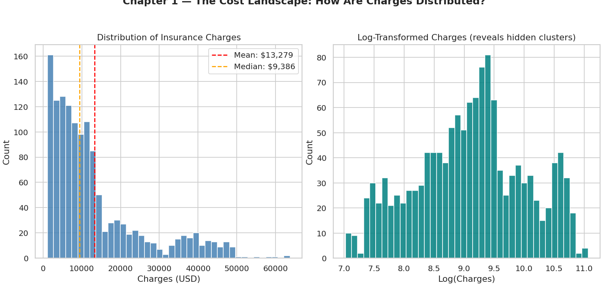
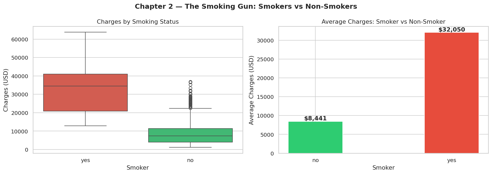
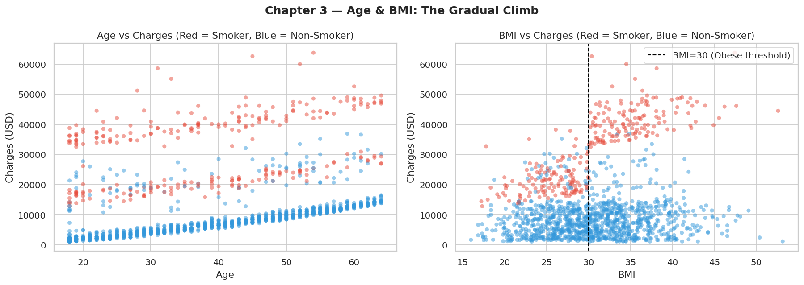
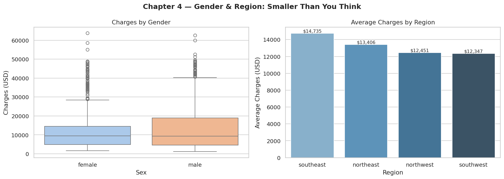
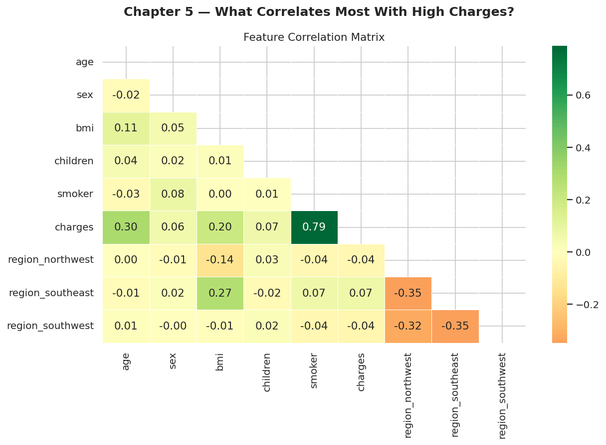
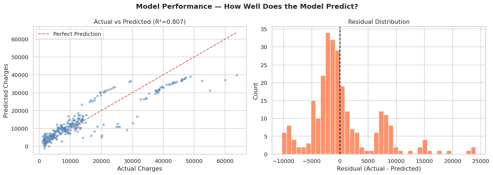
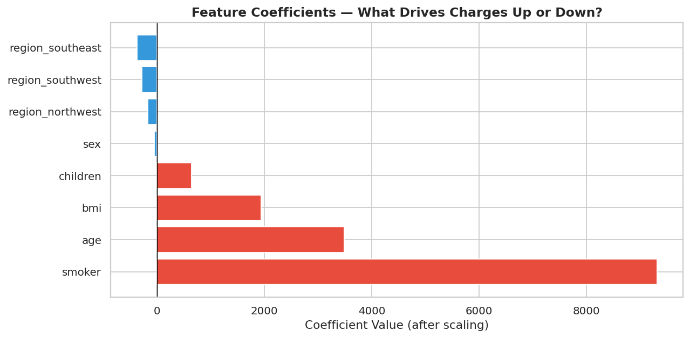

# python-insurance-cost-analysis
What actually drives insurance costs? A Python EDA and regression project uncovering the impact of smoking, age, and BMI on medical charges — with visualizations and a linear regression model.
# Medical Insurance Cost Analysis — Python EDA + Linear Regression


## Project Overview

A complete exploratory data analysis and linear regression project on medical insurance charges. Using a real-world dataset of 1,338 patients, this project uncovers which personal factors — age, BMI, smoking status, region — drive insurance costs, and builds a predictive model to quantify their impact.

**Business Question:** *"What factors actually drive insurance costs — and by how much?"*

---

## Repository Structure

```
python-insurance-cost-analysis/
│
├── insurance_analysis.py           # Main analysis script
├── insurance.csv                   # Dataset
├── output.txt                      # Full console output with stats and insights
├── chapter1_distribution.png       # Charge distribution + log transform
├── chapter2_smoking.png            # Smoker vs non-smoker analysis
├── chapter3_age_bmi.png            # Age & BMI scatter plots
├── chapter4_gender_region.png      # Gender & region breakdowns
├── chapter5_heatmap.png            # Correlation heatmap
├── model_performance.png           # Actual vs predicted + residuals
├── feature_importance.png          # Feature coefficients chart
└── README.md
```

---

## Libraries Used

```python
import pandas as pd
import numpy as np
import matplotlib.pyplot as plt
import seaborn as sns
from sklearn.linear_model import LinearRegression
from sklearn.model_selection import train_test_split
from sklearn.preprocessing import LabelEncoder, StandardScaler
from sklearn.metrics import r2_score, mean_absolute_error, mean_squared_error
```

---

## Dataset

- **Source:** [Medical Cost Personal Dataset on Kaggle](https://www.kaggle.com/datasets/mirichoi0218/insurance)
- **Size:** 1,338 rows x 7 columns
- **Features:** `age`, `sex`, `bmi`, `children`, `smoker`, `region`, `charges`
- **Missing Values:** 0
- **Duplicates Found:** 1 (removed during cleaning)

**Statistical Summary:**

| Feature | Mean | Min | Max |
|---|---|---|---|
| Age | 39.2 | 18 | 64 |
| BMI | 30.66 | 15.96 | 53.13 |
| Children | 1.09 | 0 | 5 |
| Charges | $13,270 | $1,122 | $63,770 |

---

## Project Workflow

### Chapter 1 — Data Loading & Distribution
- Loaded and inspected 1,338 patient records
- Identified 1 duplicate row and removed it
- Plotted charge distribution — confirmed right skew with two distinct clusters (low-cost majority and high-cost minority driven by smokers)
- Applied log transformation to normalize the distribution

### Chapter 2 — Smoking Analysis
- Compared smoker vs non-smoker charge distributions
- Boxplot and bar chart revealing the full cost gap between groups

### Chapter 3 — Age & BMI Impact
- Scatter plots of age and BMI vs charges
- Colored by smoker status to reveal three distinct charge bands driven entirely by smoking

### Chapter 4 — Gender & Region Breakdown
- Boxplot of charges by gender — minimal difference found
- Bar plot of average charges by region — slight variation but not significant

### Chapter 5 — Correlation Heatmap
- Heatmap of all numeric features
- Smoker status showed the highest correlation with charges (0.79)

### Chapter 6 — Linear Regression Model
- Label Encoding: `sex`, `smoker` (binary)
- One-Hot Encoding: `region` (4 categories → 3 dummies)
- StandardScaler applied to all numerical features
- 80/20 train-test split

### Chapter 7 — Feature Importance
- Bar chart of model coefficients ranked by impact
- Smoking, age, and BMI are the top three cost drivers

---

## Model Performance

| Metric | Score |
|---|---|
| R² Score | 0.8069 (80.7% variance explained) |
| MAE | $4,177.05 |
| RMSE | $5,956.34 |

**Top Feature Coefficients:**

| Feature | Coefficient |
|---|---|
| smoker | +$9,315 |
| age | +$3,485 |
| bmi | +$1,944 |
| children | +$642 |
| sex | -$51 |
| region_northwest | -$168 |
| region_southwest | -$283 |
| region_southeast | -$373 |

---

## Visualizations

### Chapter 1 — Charge Distribution


### Chapter 2 — Smoking Analysis


### Chapter 3 — Age & BMI


### Chapter 4 — Gender & Region


### Chapter 5 — Correlation Heatmap


### Model Performance


### Feature Importance


---

## Key Insights

**1. Smoking is the #1 Cost Driver**
Smokers pay 3.8x more than non-smokers on average — $32,050 vs $8,441. Insurers should invest in smoking cessation programs to reduce their highest-cost claims.

**2. Age Compounds Costs — But Only for Smokers**
Non-smokers show a gentle, manageable cost increase with age. Smokers show a steep, accelerating cost curve. Age-based pricing alone is insufficient — the smoking x age interaction is the real risk multiplier.

**3. Obesity + Smoking = Highest Risk Profile**
The most expensive patients are smokers with BMI above 30. Wellness programs targeting this combined profile could yield the biggest cost savings for insurers.

**4. Gender and Region are Weak Pricing Factors**
Minimal difference in charges by sex or region. Risk-based pricing should focus on smoking, BMI, and age — not geography or gender.

**5. Model Explains 80.7% of Cost Variance**
Linear regression captures the broad patterns well. Residuals suggest non-linear interactions exist (e.g. smoking x BMI synergy). A more advanced model such as Random Forest or XGBoost could push accuracy further.

---

## How to Run

```bash
# 1. Clone the repo
git clone https://github.com/yourusername/python-insurance-cost-analysis.git
cd python-insurance-cost-analysis

# 2. Install dependencies
pip install pandas numpy matplotlib seaborn scikit-learn

# 3. Run the analysis
python insurance_analysis.py
```

All 7 output charts and the console output will be saved automatically.


All 7 output charts and the console output will be saved automatically.
